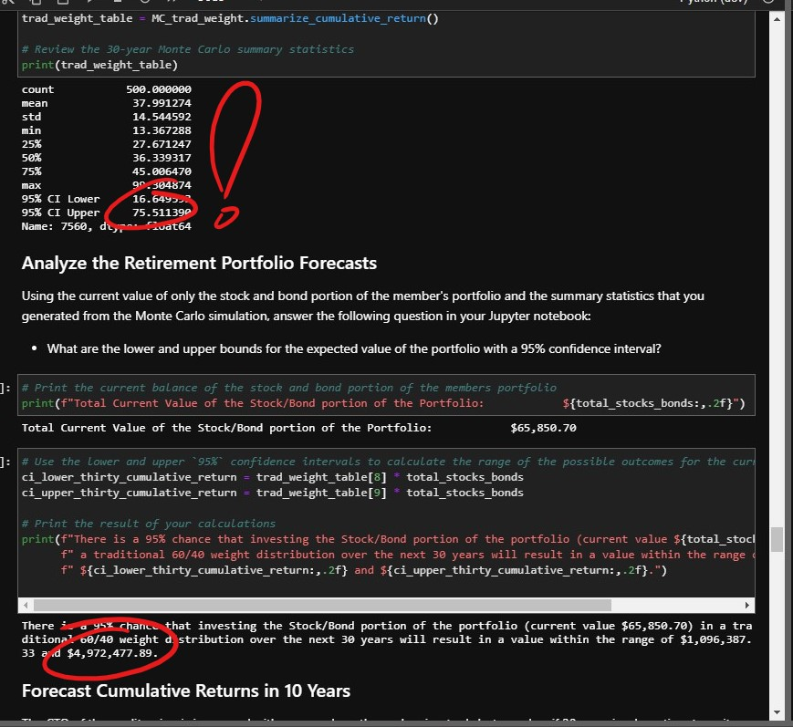

# **M5_Challenge_Submission**
## **Financial Planning with APIs and Simulations**
### For this Project, we created two financial analysis tools for a local Credit Union by using a single Jupyter notebook:

### **Part 1: Financial Planner for Emergencies** 
> The members are now able to use this tool to visualize their current savings. Further, they can then determine if they have enough reserves for an emergency fund.

### **Part 2: Financial Planner for Retirement** 
> This tool forecasts the performance of the member's retirement portfolio over the course of 30 years. To do this, we developed a tool that makes Alpaca API calls via the Alpaca SDK to obtain both live and historical price data for use in our Monte Carlo simulations.

We then proceeded to use the statistics generated from the Monte Carlo simulation(s) to answer critical questions about the portfolio in our Jupyter notebook.

---
###  **NOTE**
At the time this repo was updated (2021.2.4.18:00) it appears that Alpaca API was experiencing some issues with calling data for dates before 2020. As a result, the statistics from the 30-Year MC simulations are bad and will need to be re-read into the repo at a later time.

